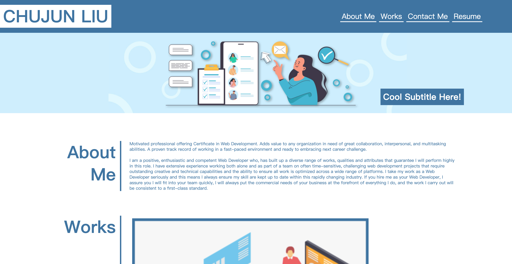
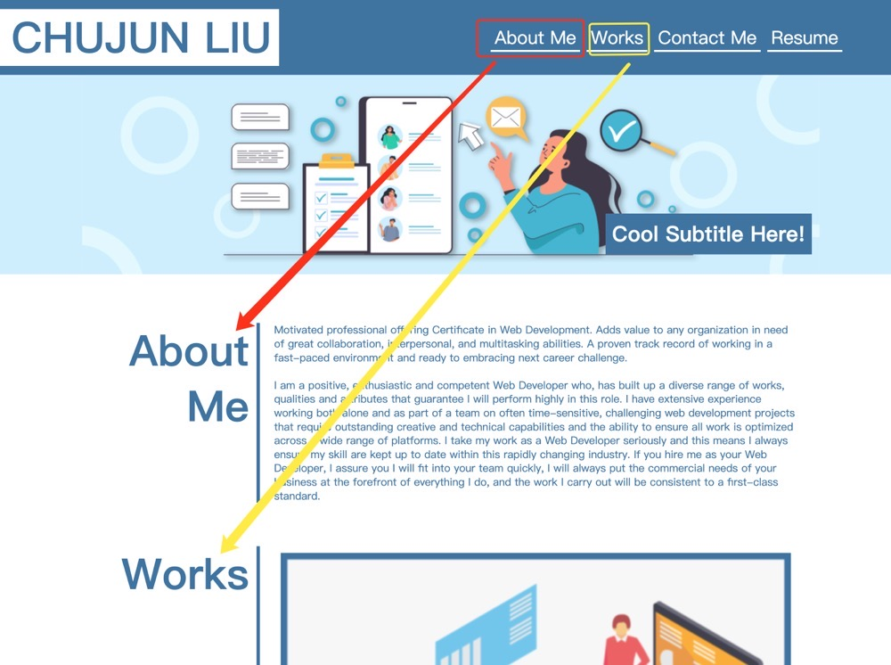
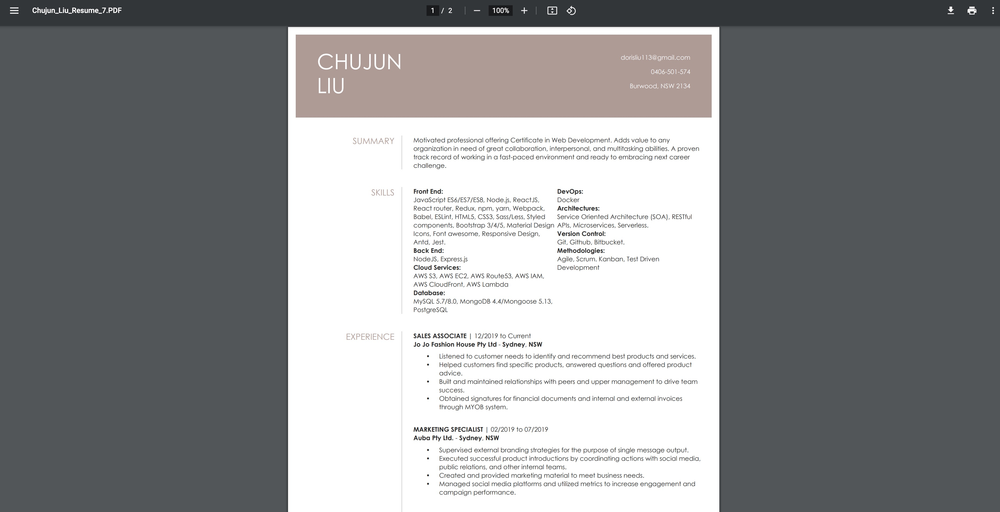
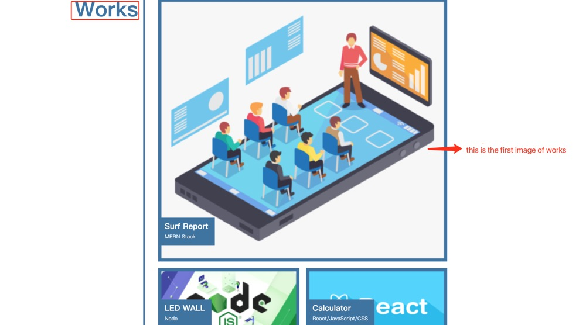
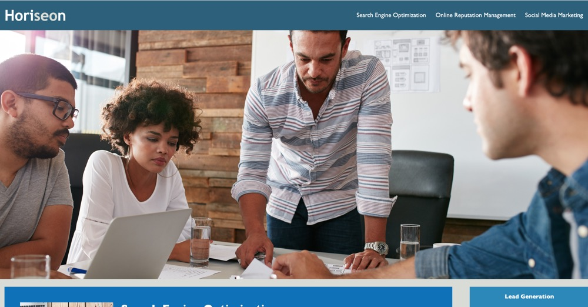
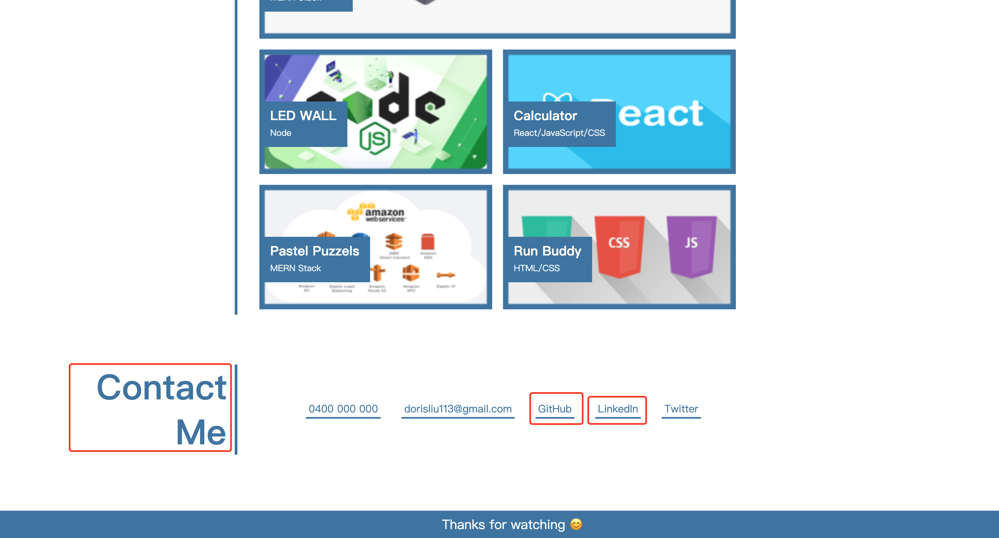
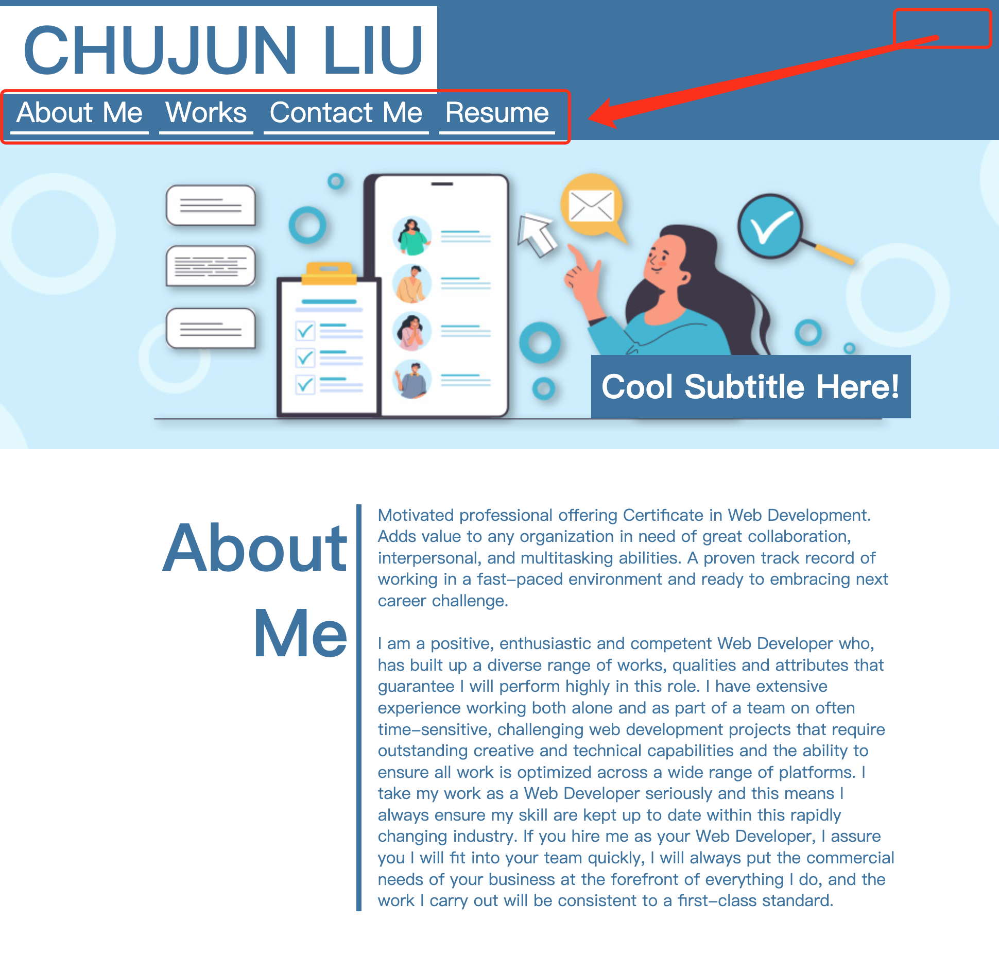
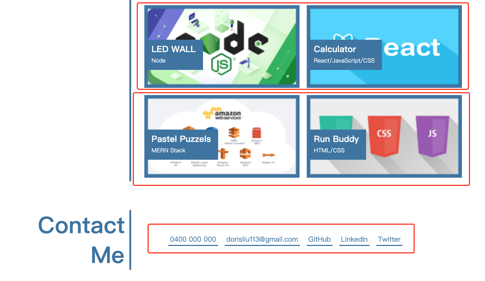
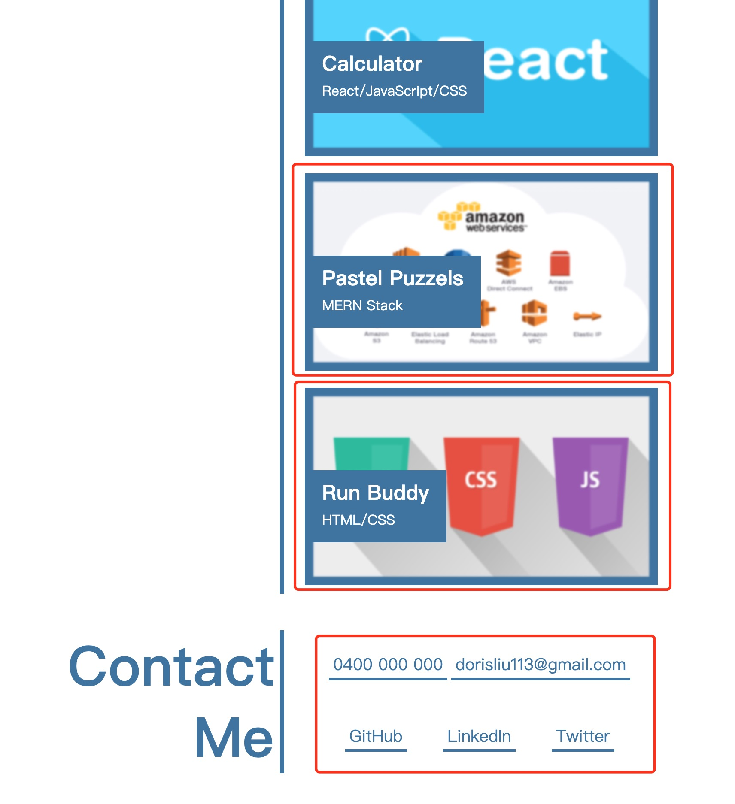

## Chujun's portfolio page

* This is my potential portfolio, it will show my professional works and personal information.

## Portfolio page will show below
* open the page, it shows name, and links to sections about them, their work, and how to contact information

* click one of the links in the navigation, the UI scrolls to the corresponding section

* click one of the resume links in the navigation, it shows my resume PDF file

* click on the link to the section about their work, the UI scrolls to a section with titled images of the developer's applications, and the first image is  larger in size than the others

* click on the images of the applications, it takes to its own deployed application
when you click the first image will show my first work

And click the second image will show my second work...

* click on the github and linkedIn, it will show the pages of my github and linkedIn

* resize the page or view the site on various screens and devices, it presents with a responsive layout that adapts to my viewport

The block will resize when the page

## Deployment URL
https://dorisliu333.github.io/ChujunLiu_Professional_Portfolio/